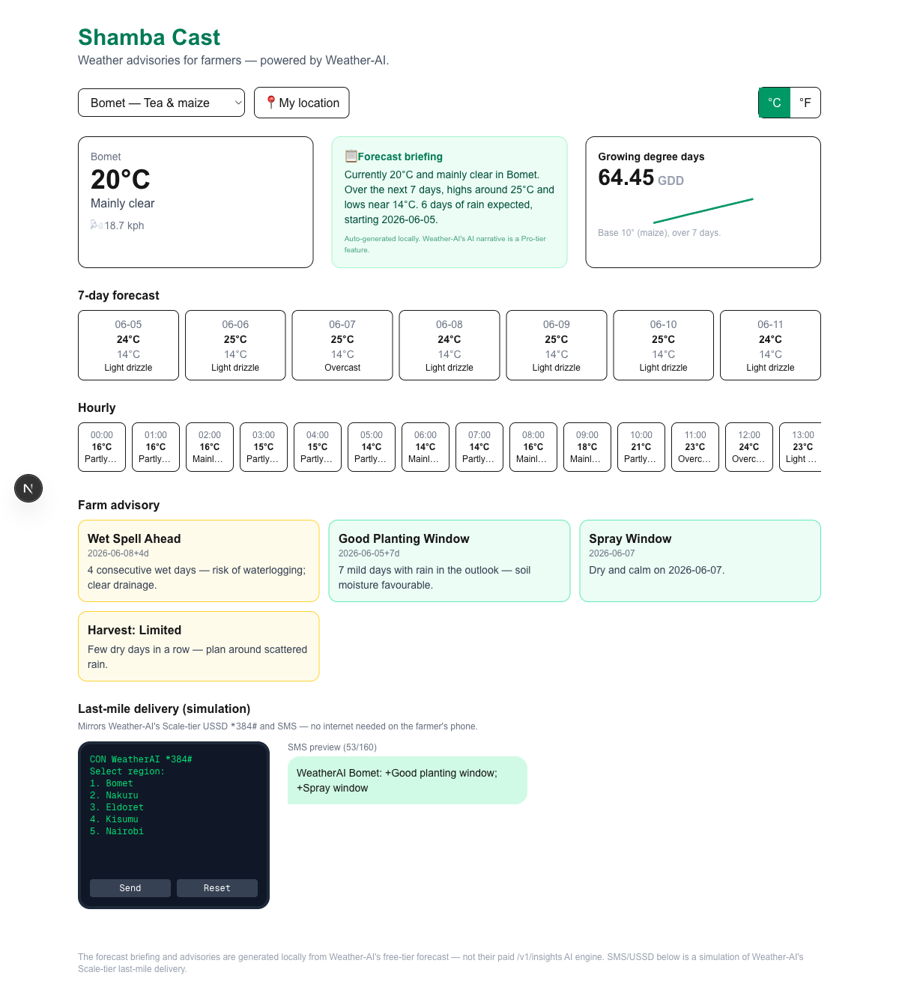

# 🌾 Shamba Cast

**Weather advisories for farmers — powered by the [Weather-AI](https://weather-ai.co) API.**

> _Shamba_ is Swahili for "farm". Shamba Cast turns a raw weather forecast into the decisions a
> smallholder farmer actually makes — when to plant, when to spray, when to harvest — and shows
> how that advice reaches a feature phone over SMS/USSD, no internet required.

🔗 **Live demo:** <https://shamba-cast.vercel.app>
📦 **Repo:** <https://github.com/cloud-007/shamba-cast>



---

## Why this, and not just another weather dashboard

Weather-AI isn't a generic weather API — it's a Nairobi-based platform whose mission is
**last-mile agro-advisory for African smallholder farmers**, delivered to any phone (USSD `*384#`,
SMS, feature phones included). In Kenya, ~98% of farmers own a phone and SMS is the *preferred*
channel for agricultural advice.

So Shamba Cast is built around that mission rather than around the API's mechanics:

- It reframes the free-tier forecast as **farm decisions**, not just numbers.
- It turns the forecast into a plain-language **briefing** a farmer can act on (Weather-AI's own
  AI narrative is a Pro-tier feature this would swap in).
- It includes an in-browser **USSD + SMS simulator** that mirrors Weather-AI's flagship
  Scale-tier last-mile delivery — so you can see the whole product story end to end.

Everything runs on the **free tier**.

## Features

- **Forecast briefing** — a concise, plain-language summary generated locally from the free-tier forecast (Weather-AI's AI narrative is a Pro feature).
- **Current + 7-day + hourly** forecast, with a °C/°F toggle.
- **Growing Degree Days (GDD)** — heat-accumulation tracker (base 10 °C, maize) computed from the
  daily high/low, with a sparkline.
- **Farm advisory engine** — derives planting / spraying / harvesting windows plus frost and
  heavy-rain alerts from the forecast, each with a plain-language "why".
- **Last-mile delivery simulator** — a feature-phone `*384#` USSD flow and a ≤160-character SMS
  preview, generated from the same advisory data.
- **Location** — preset Kenyan farming regions (Bomet, Nakuru, Eldoret, Kisumu, Nairobi) or
  "detect my location" via the browser.
- **Safe by design** — the API key lives only on the server; the browser never sees it.

## Architecture

```
Browser (React components)
   │  GET /api/forecast?lat&lon&units
   ▼
Next.js API route  (app/api/forecast/route.ts)   ← holds WEATHER_AI_API_KEY (server-only)
   │  GET https://api.weather-ai.co/v1/weather?lat&lon&units
   ▼
Weather-AI ──▶ normalize (Zod, WMO codes) ──▶ NormalizedResponse
   │
   ├─▶ lib/gdd.ts       → growing degree days
   ├─▶ lib/advisory.ts  → plant / spray / harvest / frost / rain
   ├─▶ lib/summary.ts   → local plain-language briefing
   └─▶ lib/sms.ts       → ≤160-char SMS + USSD screens
```

The Weather-AI key is read only inside the server route via `process.env` and is **never**
exposed to the client. All business logic lives in small, pure, unit-tested modules
(`lib/gdd.ts`, `lib/advisory.ts`, `lib/sms.ts`).

**Stack:** Next.js 16 (App Router) · TypeScript · Tailwind CSS · Zod · Vitest.

## Project layout

```
app/
  page.tsx                  # dashboard shell + data loading
  api/forecast/route.ts     # server proxy (holds the API key)
components/                 # presentational UI (CurrentCard, ForecastStrip, AdvisoryPanel, …)
lib/
  weatherai.ts              # typed client + defensive parsing + error mapping
  gdd.ts  advisory.ts  sms.ts   # pure logic (unit-tested)
  regions.ts  types.ts  fixtures/sample.ts
tests/                      # Vitest unit tests for the pure logic
```

## Getting started

### 1. Get a free Weather-AI API key
1. Create a free account at <https://weather-ai.co> (no credit card; 1,000 requests/month).
2. Go to **Dashboard → API Keys** and generate a key (it's shown once, prefixed `wai_`).

### 2. Run locally
```bash
git clone git@github.com:cloud-007/shamba-cast.git
cd shamba-cast
cp .env.example .env.local        # then paste your key:
# .env.local →  WEATHER_AI_API_KEY=wai_your_key_here
npm install
npm run dev                       # http://localhost:3000
```

> Without a key the app still runs — it falls back to bundled sample data and shows a notice — so
> you can explore the UI immediately.

### 3. Tests & build
```bash
npm test         # Vitest unit tests for gdd / advisory / sms
npm run build    # production build
```

## Deployment

Deployed on **Vercel**. To deploy your own:
1. Import this repo at <https://vercel.com/new>.
2. Add an environment variable **`WEATHER_AI_API_KEY`** = your `wai_` key.
3. Deploy. (The same single repo serves both the UI and the `/api/forecast` proxy.)

## Honest scope — what's real vs. simulated

This was built in a take-home time-box on the **free tier**, so I was deliberate about what's real:

- ✅ **Real:** all weather data (current, daily, hourly) comes from Weather-AI's `GET /v1/weather`.
- 🧮 **Derived:** the planting/spraying/harvesting/frost/GDD advice is computed *by this app* from
  the free forecast. It is **not** Weather-AI's paid `GET /v1/insights` agronomic engine (Pro+).
  Each card states its reasoning so nothing is a black box. The forecast briefing is also generated
  locally — Weather-AI's AI summary / `/v1/insights` requires a Pro plan (returns 403 on free).
- 🎭 **Simulated:** the USSD/SMS panel is a faithful UI mock of Weather-AI's Scale-tier
  SMS/USSD delivery — it does not send real messages (that endpoint requires a Scale plan and
  carrier approval).

## What I'd build next with Pro / Scale

- Swap the derived advisory for Weather-AI's real **`/v1/insights`** (agronomic context, risk
  flags, recommendations) and **`/v1/forecast14`**.
- Wire the simulator to the real **`/v1/sms/*`** endpoints for genuine last-mile delivery, plus
  **`/v1/webhooks`** for push alerts on frost/heavy-rain.
- Add Swahili localisation and per-crop GDD base temperatures.
- Persist farmer registrations (their `/v1/sms/bomet/register` flow) and usage analytics
  (`/v1/usage`).

---

_Built as a technical assessment for Weather-AI._
